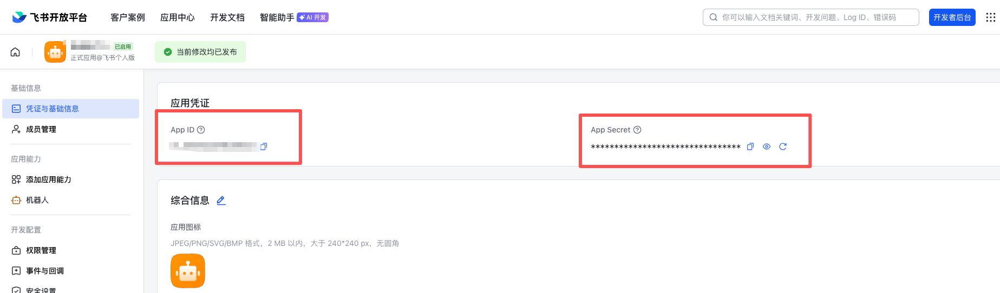
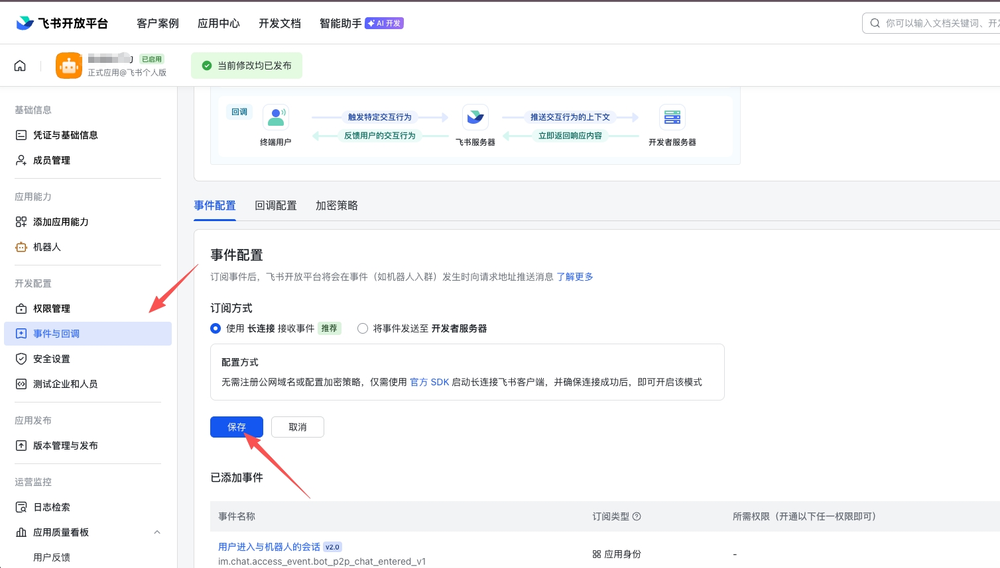

# Lark Imagine Robot

飞书 AI 图片生成机器人 — 在飞书中通过自然语言描述生成图片。

## 功能特性

- **自然语言生图** — 发送文字描述，AI 自动生成对应图片
- **参考图片输入** — 支持发送图片作为参考，结合文字描述生成新图片
- **丰富的生成参数** — 通过交互卡片选择艺术风格、画面比例、亮度、色调、精细度等
- **多种连接模式** — 支持 WebSocket 长连接（推荐，无需公网域名）和 Webhook 两种模式
- **并发队列控制** — 可配置最大并发数和队列长度，防止服务过载
- **API Key 安全缓存** — 用户 API Key 使用 AES-256-GCM 加密存储，LRU 淘汰 + TTL 过期
- **群聊 & 私聊** — 群聊中 @机器人 触发，私聊直接发送即可

## 工作流程

```
用户发送消息 (文字/图片)
       ↓
  机器人回复确认卡片
  (选择风格、比例、亮度等参数)
       ↓
  用户提交表单 + API Key
       ↓
  进入生成队列 → 调用 Gemini API
       ↓
  生成完成 → 更新卡片展示结果图片
```

## 技术栈

- **Runtime** — Node.js + TypeScript
- **飞书 SDK** — @larksuiteoapi/node-sdk
- **AI 生图** — Google Gemini (@google/genai)，同时支持 OpenAI 兼容接口
- **配置校验** — Zod
- **HTTP 框架** — Express（仅 Webhook 模式）

## 快速开始

### 1. 安装依赖

```bash
pnpm install
```

### 2. 配置环境变量

复制 `.env.example` 并填写实际配置：

```bash
cp .env.example .env
```

**必填项：**

<!-- 图像 -->


| 变量 | 说明 |
|---|---|
| `LARK_APP_ID` | 飞书应用的 App ID |
| `LARK_APP_SECRET` | 飞书应用的 App Secret |

**可选项：**

| 变量 | 默认值 | 说明 |
|---|---|---|
| `CONNECTION_MODE` | `websocket` | 连接模式：`websocket`（推荐）或 `webhook` |
| `PORT` | `3000` | HTTP 服务端口（仅 Webhook 模式） |
| `GEMINI_BASE_URL` | `https://generativelanguage.googleapis.com` | Gemini API 地址 |
| `GEMINI_MODEL` | `gemini-3-pro-image-preview` | Gemini 模型名称 |
| `LARK_WEBHOOK_URL` | - | 自定义机器人 Webhook URL，生成结果推送到群聊 |
| `QUEUE_MAX_CONCURRENCY` | `3` | 最大并发生成数 |
| `QUEUE_MAX_LENGTH` | `20` | 最大排队长度 |
| `CACHE_TTL_MINUTES` | `1440` | API Key 缓存有效期（分钟） |
| `CACHE_MAX_SIZE` | `500` | 最大缓存用户数 |
| `CACHE_ENCRYPT_SECRET` | - | API Key 加密密钥（至少 8 位） |

> Webhook 模式还需配置 `LARK_VERIFICATION_TOKEN` 和 `LARK_ENCRYPT_KEY`。

### 3. 启动服务

```bash
# 开发模式 (热重载)
pnpm dev

# 生产模式
pnpm start
```

## 飞书应用配置

<!-- 图像 -->


1. 前往 [飞书开放平台](https://open.feishu.cn/) 创建企业自建应用
2. 开启**机器人**能力
3. 配置权限：
   - `im:message` — 读取消息
   - `im:message:send_as_bot` — 以机器人身份发送消息
   - `im:resource` — 读取消息中的资源文件（图片下载）
4. 根据连接模式配置：
   - **WebSocket 模式**：无需额外配置，推荐使用
   - **Webhook 模式**：在事件订阅中配置回调地址 `https://your-domain/webhook/event`，卡片回调地址 `https://your-domain/webhook/card`
5. 订阅事件：`im.message.receive_v1`

## 项目结构

```
src/
├── index.ts                  # 入口，启动 WebSocket/Webhook 服务
├── config.ts                 # 环境变量解析与校验 (Zod)
├── cache/
│   ├── api-key-cache.ts      # API Key 缓存服务 (加密 + LRU + TTL)
│   └── encrypted-lru-cache.ts # 通用加密 LRU 缓存 (AES-256-GCM)
├── cards/
│   ├── actions.ts            # 卡片交互回调处理
│   └── templates.ts          # 飞书交互卡片模板 + Prompt 修饰
├── events/
│   └── message-handler.ts    # 消息事件处理 (解析/去重/@检测)
├── generation/
│   ├── executor.ts           # 图片生成执行流程
│   ├── types.ts              # 生成服务接口定义
│   └── providers/
│       ├── gemini.ts         # Google Gemini Provider
│       └── openai.ts         # OpenAI 兼容 Provider
├── lark/
│   ├── client.ts             # 飞书 SDK 客户端
│   ├── bot-info.ts           # 机器人信息服务
│   ├── image.ts              # 图片上传/下载服务
│   ├── message.ts            # 消息发送/回复/更新服务
│   └── webhook.ts            # 自定义机器人 Webhook 服务
├── queue/
│   └── generation-queue.ts   # 生成任务队列 (并发控制 + FIFO)
├── session/
│   └── manager.ts            # 会话管理 (生命周期 + TTL 清理)
└── utils/
    └── logger.ts             # 日志工具
```

## 生成参数

用户通过交互卡片可选择以下参数：

| 参数 | 选项 |
|---|---|
| 艺术风格 | 默认、写实、动漫、水彩、油画、像素风、扁平插画、赛博朋克、素描、3D 渲染 |
| 画面比例 | 1:1、16:9、9:16、4:3、3:4 |
| 亮度调节 | 默认、暗调、自然光、明亮、高调 |
| 色调倾向 | 默认、暖色、冷色、黑白、复古、鲜艳、粉彩 |
| 精细度 | 默认、简约、标准、精细、超精细 |
| 排除词 | 自由输入不希望出现的元素 |
| 随机种子 | 固定数值可复现同一张图 |

## License

MIT
