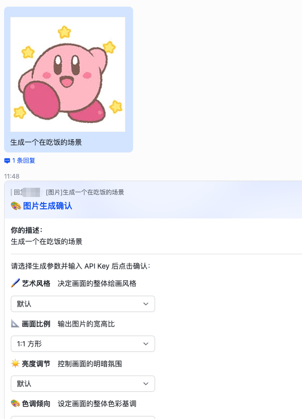
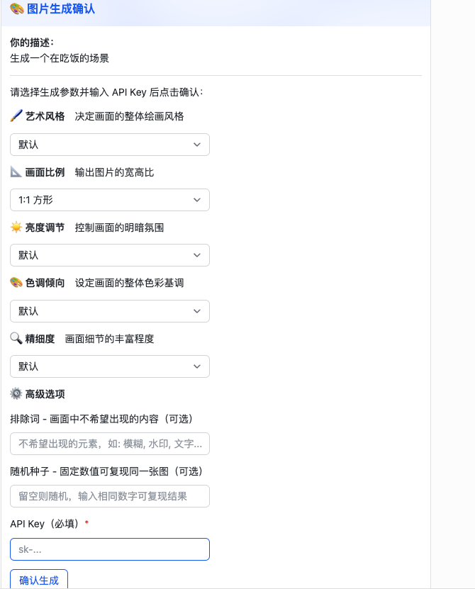
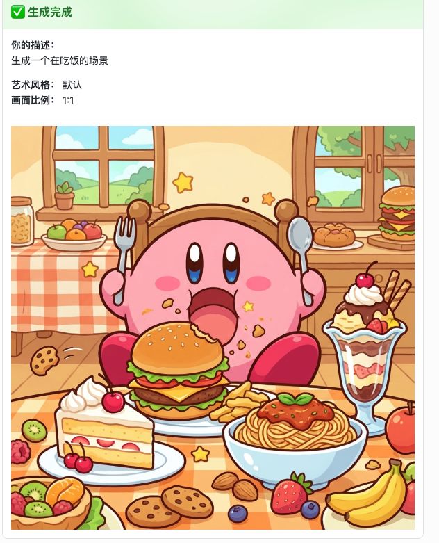
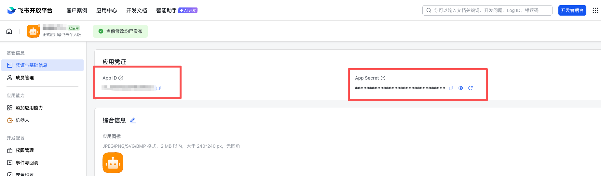
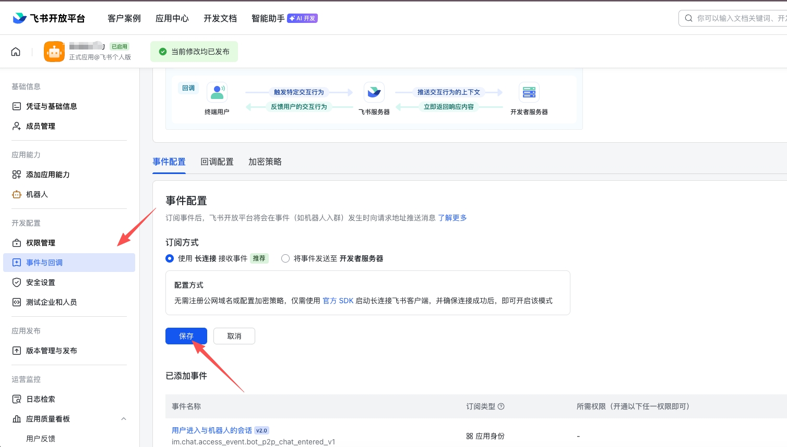

# Lark Imagine Robot

**English | [中文](./README.md)**

An AI image generation bot for Lark (Feishu) — generate images from natural language descriptions directly in Lark.

## Screenshots

<!-- Images -->




## Features

- **Text-to-Image** — Send a text description and AI generates the corresponding image
- **Reference Image Input** — Send an image as reference, combined with text description to generate new images
- **Rich Generation Parameters** — Choose art style, aspect ratio, brightness, color tone, detail level via interactive cards
- **Multiple Connection Modes** — WebSocket (recommended, no public domain required) and Webhook
- **Concurrency Queue Control** — Configurable max concurrency and queue length to prevent service overload
- **Secure API Key Caching** — User API Keys encrypted with AES-256-GCM, LRU eviction + TTL expiration
- **Group & Direct Chat** — Mention @bot in group chats, or send directly in private chats

## Workflow

```
User sends message (text/image)
       ↓
  Bot replies with confirmation card
  (select style, ratio, brightness, etc.)
       ↓
  User submits form + API Key
       ↓
  Enters generation queue → Calls Gemini API
       ↓
  Generation complete → Card updated with result image
```

## Tech Stack

- **Runtime** — Node.js + TypeScript
- **Lark SDK** — @larksuiteoapi/node-sdk
- **AI Image Generation** — Google Gemini (@google/genai), also supports OpenAI-compatible API
- **Config Validation** — Zod
- **HTTP Framework** — Express (Webhook mode only)

## Getting Started

### 1. Install Dependencies

```bash
pnpm install
```

### 2. Configure Environment Variables

Copy `.env.example` and fill in your configuration:

```bash
cp .env.example .env
```

**Required:**

<!-- Images -->


| Variable | Description |
|---|---|
| `LARK_APP_ID` | Lark app's App ID |
| `LARK_APP_SECRET` | Lark app's App Secret |

**Optional:**

| Variable | Default | Description |
|---|---|---|
| `CONNECTION_MODE` | `websocket` | Connection mode: `websocket` (recommended) or `webhook` |
| `PORT` | `3000` | HTTP server port (Webhook mode only) |
| `GEMINI_BASE_URL` | `https://generativelanguage.googleapis.com` | Gemini API base URL |
| `GEMINI_MODEL` | `gemini-3-pro-image-preview` | Gemini model name |
| `LARK_WEBHOOK_URL` | - | Custom bot Webhook URL for pushing results to group chat |
| `QUEUE_MAX_CONCURRENCY` | `3` | Max concurrent generations |
| `QUEUE_MAX_LENGTH` | `20` | Max queue length |
| `CACHE_TTL_MINUTES` | `1440` | API Key cache TTL (minutes) |
| `CACHE_MAX_SIZE` | `500` | Max cached users |
| `CACHE_ENCRYPT_SECRET` | - | API Key encryption secret (min 8 characters) |

> Webhook mode also requires `LARK_VERIFICATION_TOKEN` and `LARK_ENCRYPT_KEY`.

### 3. Start the Service

```bash
# Development mode (hot reload)
pnpm dev

# Production mode
pnpm start
```

## Lark App Configuration

<!-- Images -->


1. Go to [Lark Open Platform](https://open.feishu.cn/) and create an enterprise custom app
2. Enable **Bot** capability
3. Configure permissions:
   - `im:message` — Read messages
   - `im:message:send_as_bot` — Send messages as bot
   - `im:resource` — Read message resources (image download)
4. Configure based on connection mode:
   - **WebSocket mode**: No additional configuration needed (recommended)
   - **Webhook mode**: Set event callback URL to `https://your-domain/webhook/event`, card callback URL to `https://your-domain/webhook/card`
5. Subscribe to event: `im.message.receive_v1`

## Project Structure

```
src/
├── index.ts                  # Entry point, starts WebSocket/Webhook service
├── config.ts                 # Environment variable parsing & validation (Zod)
├── cache/
│   ├── api-key-cache.ts      # API Key cache service (encryption + LRU + TTL)
│   └── encrypted-lru-cache.ts # Generic encrypted LRU cache (AES-256-GCM)
├── cards/
│   ├── actions.ts            # Card interaction callback handler
│   └── templates.ts          # Lark interactive card templates + prompt decoration
├── events/
│   └── message-handler.ts    # Message event handler (parse/dedup/@detection)
├── generation/
│   ├── executor.ts           # Image generation execution flow
│   ├── types.ts              # Generation service interface definitions
│   └── providers/
│       ├── gemini.ts         # Google Gemini Provider
│       └── openai.ts         # OpenAI-compatible Provider
├── lark/
│   ├── client.ts             # Lark SDK client
│   ├── bot-info.ts           # Bot info service
│   ├── image.ts              # Image upload/download service
│   ├── message.ts            # Message send/reply/update service
│   └── webhook.ts            # Custom bot Webhook service
├── queue/
│   └── generation-queue.ts   # Generation task queue (concurrency control + FIFO)
├── session/
│   └── manager.ts            # Session management (lifecycle + TTL cleanup)
└── utils/
    └── logger.ts             # Logger utility
```

## Generation Parameters

Users can select the following parameters via interactive cards:

| Parameter | Options |
|---|---|
| Art Style | Default, Realistic, Anime, Watercolor, Oil Painting, Pixel Art, Flat Illustration, Cyberpunk, Sketch, 3D Render |
| Aspect Ratio | 1:1, 16:9, 9:16, 4:3, 3:4 |
| Brightness | Default, Dark, Natural Light, Bright, High Key |
| Color Tone | Default, Warm, Cool, Black & White, Vintage, Vivid, Pastel |
| Detail Level | Default, Minimal, Standard, Detailed, Ultra Detailed |
| Negative Prompt | Free text input for elements to exclude |
| Random Seed | Fixed value to reproduce the same image |

## License

MIT
